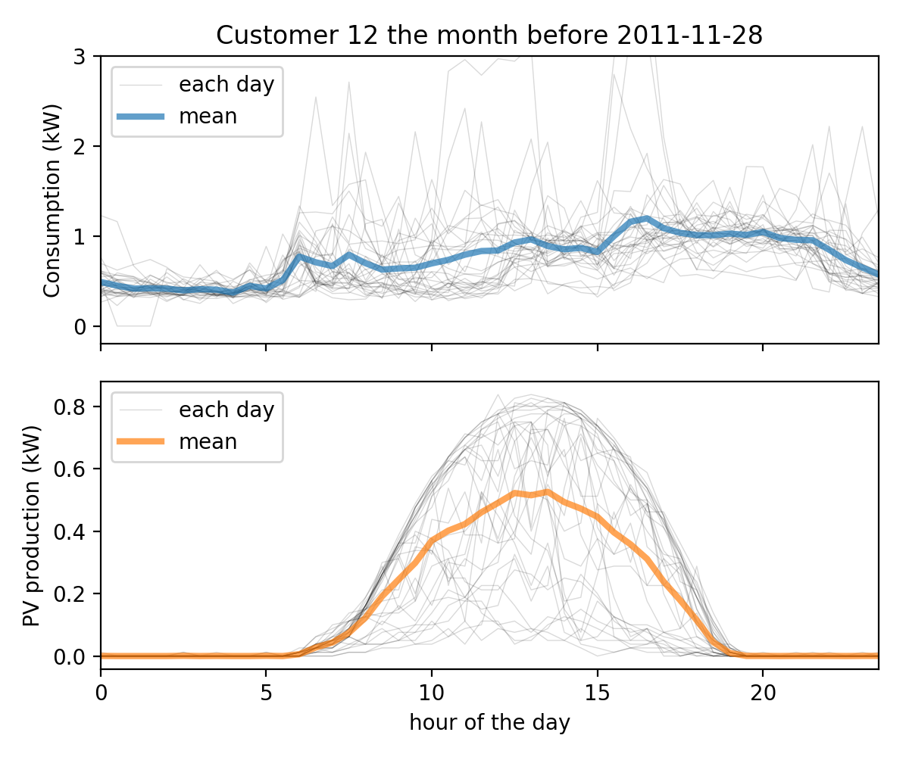
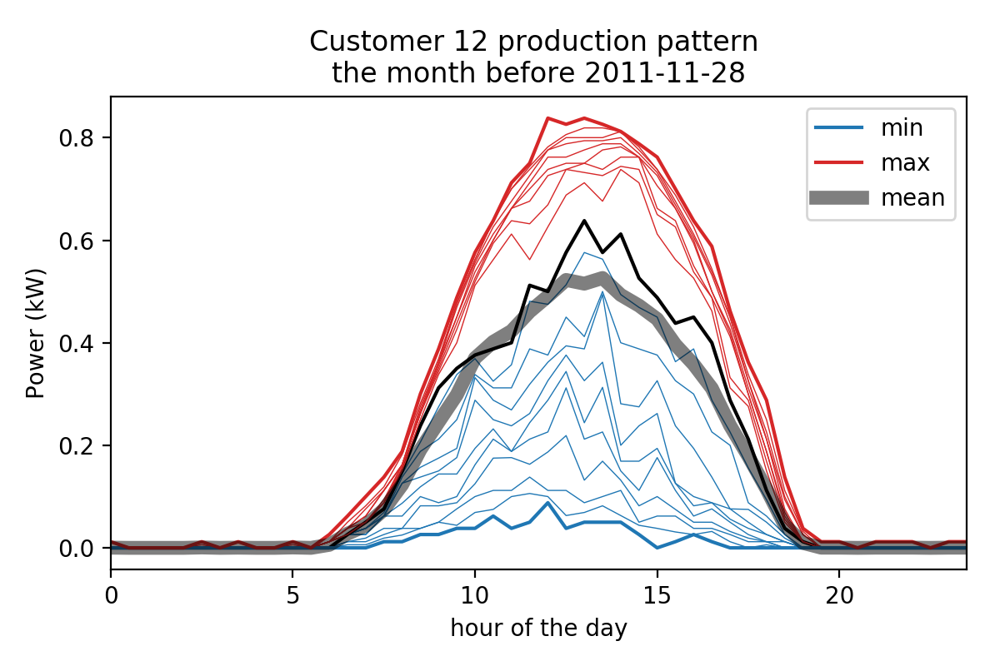
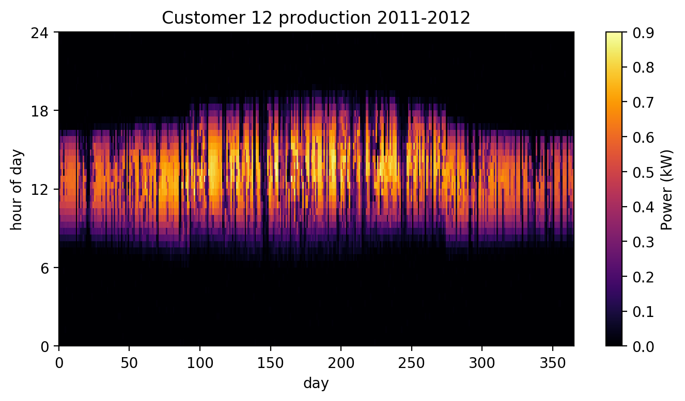
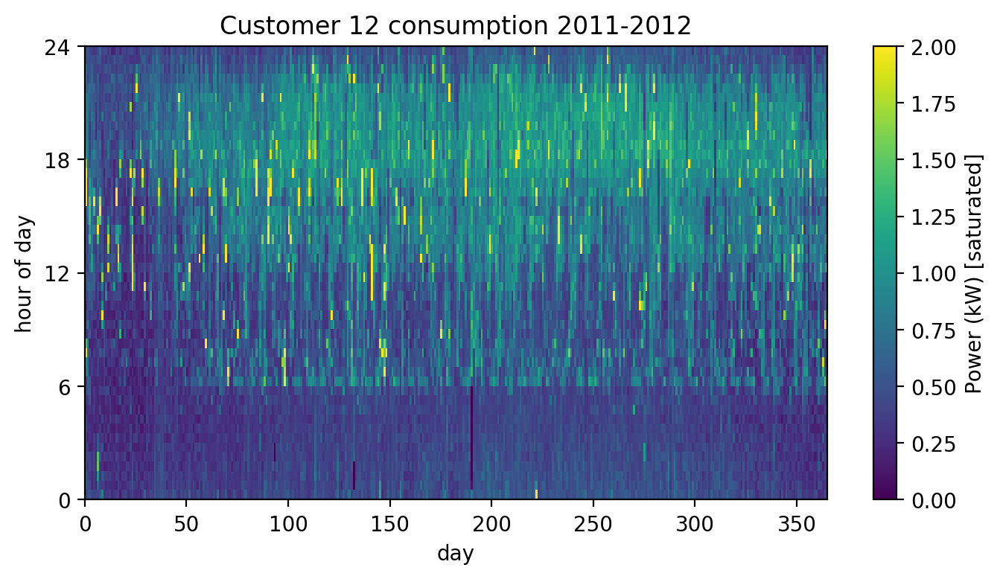

# Solar and load data

Solar production (from PV panels) and home consumption data is taken from the
[Solar home electricity dataset](http://www.ausgrid.com.au/Common/About-us/Corporate-information/Data-to-share/Solar-home-electricity-data.aspx) by Ausgrid (distribution grid operator in the region near Sydney).
Data extraction was performed with the Python code in the
[ausgrid-solar-data](https://github.com/pierre-haessig/ausgrid-solar-data) repository,
in particular with the [Customer exploration.ipynb](https://github.com/pierre-haessig/ausgrid-solar-data/blob/master/Customer%20exploration.ipynb) notebook.
Data and plot image files in this directory were copied from the [customer/12/]( https://github.com/pierre-haessig/ausgrid-solar-data/tree/master/customer/12) folder of that repository.

For the solarhome benchmark, I've selected year 2011-2012 for "Customer 12" (out of the 300 customers of the dataset). This customer has:

* No obvious missing or outlier data during the year 2011-2012
* No Controlled Load ("CL"), only General Consumption ("GC" channel), that is uncontrolled load.
* Consumption and solar production statistics close to the average of the 300 customers (cf. [Customer exploration.ipynb](https://github.com/pierre-haessig/ausgrid-solar-data/blob/master/Customer%20exploration.ipynb) notebook)

## How to load this data

You can take a look in the subfolders for your language of choice.
Loading scripts are currently provided for:

* [Matlab](matlab) (should work with Octave by adjusting the call to `csvread`)

You can also look inside the folder of each [control methods](../methods).

## Data description

Global statistics:

* Consumption: avg 0.7 kW, max 4.0 kW. Yearly total of 5 900 kWh/yr
* PV max 0.9 kW (1.04 kW capacity). Yield of 1250 kWh/yr/kWc

Here is the daily pattern (mean, 25%-75% and 05%-95% quantile intervals, at each hour of the day) for load and production over the year:


### Main data file

Main data file is the [data_2011-2012.csv](data_2011-2012.csv) CSV table:

```
,GC,GG
2011-07-01 00:00:00,0.392,0.0
2011-07-01 00:30:00,0.578,0.0
2011-07-01 01:00:00,0.568,0.0
...
```

It contains 1 year of home consumption and solar production with following columns:

1. datetime in ISO format (local time, cf. definition below), at a 30 minutes timestep
2. GC "General Consumption": home consumption
3. GG "Gross Generation": solar production

### Additional data files

In order to help some data analysis, a *pivoted table* of the same data is provided, where days are mapped to rows and hour of the day to columns:

* consumption: `daily_pivot_cons_2011-2012.csv`
* production: `daily_pivot_prod_2011-2012.csv`

```
date,0.0,0.5,...,23.0,23.5
2011-07-01,0.392,0.578,...,0.478,0.476
...
2012-06-30,0.354,0.332,...,0.374,0.454
```

## Test week for the benchmark

For the solar home energy management benchmark, I've selected 7 days starting on 2011-11-29.
This period contains some very shiny days but also some rather cloudy days:


### Forecasting

Energy management methods based on forecasts (or any sort data  modeling) **should use only past data**!

In particular the 30 preceding days are a good starting point:



### Basic forecast data

To support forecast-based energy management during the test week, I've aggregated "daily pattern" statistics over the 30 preceding days. Typically, the mean at each hour of the daycan be used for Model Predictive Control.

* consumption stats: `daily_pattern_cons_M-1-2011-11-28.csv`
* production stats: `daily_pattern_prod_M-1-2011-11-28.csv`

These two files contain one row for each hour of the day, with a 30 min timestep.
Columns are the statistics over the selected days at this hour:
mean, min, max and all the quantiles with a 5% step:
```
,mean,min,q05,q10,...,q95,max
0.0,0.491,0.264,0.328,...,0.734,1.230
0.5,0.449,0.000,0.278,...,0.607,1.162
...
23.5,0.572,0.326,0.377,...,0.970,1.30
```




### Local time definition in New South Wales

cf. Wikipedia articles [Time in Australia](https://en.wikipedia.org/wiki/Time_in_Australia)
and [Daylight saving time in Australia](https://en.wikipedia.org/wiki/Daylight_saving_time_in_Australia).

Sydney and the state of New South Wales uses the Australian Eastern Standard Time (AEST) which is UTC+10:00, with a Daylight saving time (DST) UTC+11:00.

DST starts on the first Sunday in October and end on the first Sunday in April. The change takes place at 2:00 am local standard time (which is 3:00 am DST).

Thetime shifting effect of DST is slightly visible on the yearly heatmap plot of the solar production (October 1st is day 92, April 1st is day 275):



on the other hand, the plot of the consumption shows that some consumption changes are fixed with the local time (e.g. increase after 6:00)



Because this time shifting complicates forecasting, I've selected a week of interest (+ the previous month for learning) which doesn't contain any DST change day.
